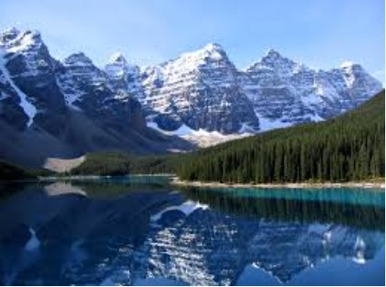
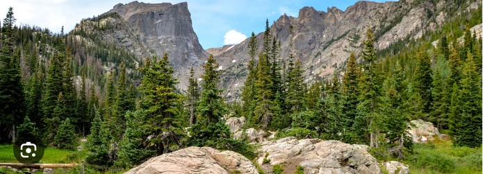
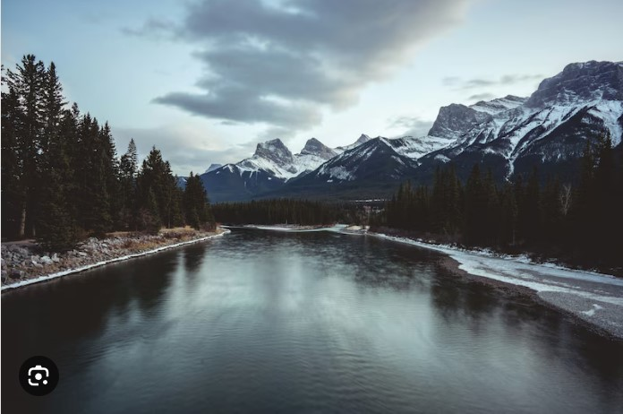

<!DOCTYPE html>
<html lang="en">
<head>
    <meta charset="UTF-8">
    <meta name="viewport" content="width=device-width, initial-scale=1.0">
    <title>Climbing Rocky Mountain Club</title>
    <link rel="stylesheet" href="css/styles.css">
</head>
<body>
    <header>
        <nav>
            <ul class="navbar">
                <li><a href="index.html">Home</a></li>
                <li><a href="about.html">About</a></li>
                <li><a href="contact.html">Contact</a></li>
            </ul>
        </nav>
    </header>

    <main class="content">
        <section class="hero">
            <h1>Welcome to the Climbing Rocky Mountain Club</h1>
            
Your source for mountain climbing resources and community events.

            
        </section>

        <section class="features">
            <article>
                
                <h2>Climbing Tips</h2>
                
Get expert advice on climbing techniques and safety.

            </article>
            <article>
                
                <h2>Upcoming Events</h2>
                
Join us for our next event in the Rocky Mountains!

            </article>
            <article>
                
                <h2>Meet Our Community</h2>
                
Connect with like-minded climbers and adventurers.

            </article>
        </section>
    </main>

    <footer>
        
&copy;  Your Name, Rocky Mountains

        
<a href="attributions.html">Attributions</a>

    </footer>
    
    
</body>
</html>
